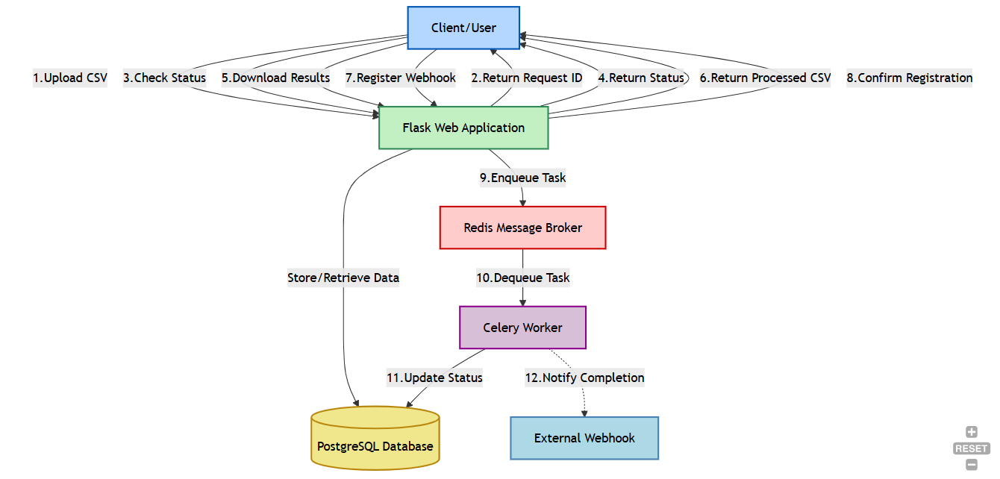

# Image Processing System

A scalable system for processing image data from CSV files using Python, Flask, PostgreSQL, and Celery.

## Documentation

- [Low Level Design Document](docs/lld_documentation.md)
- [API Documentation](docs/api_documentation.md)
- [Asynchronous Workers Documentation](docs/async_workers.md)

## Project Overview

This system processes image data from CSV files by:
1. Accepting CSV files with product and image URL data
2. Validating CSV format
3. Processing images asynchronously (compressing by 50% quality)
4. Storing processed data in PostgreSQL
5. Providing APIs for upload, status checking, and results download
6. Supporting webhook notifications for completion

## System Architecture

## API Endpoints

| Endpoint | Method | Description |
|----------|--------|-------------|
| `/api/upload` | POST | Accepts CSV file, validates format, returns request ID |
| `/api/status/{request_id}` | GET | Checks processing status using request ID |
| `/api/download/{request_id}` | GET | Downloads processed results as CSV |
| `/api/webhook` | POST | Registers webhook URL for completion notification |

## Postman Collection

Test the API endpoints using this Postman collection:
[Image Processing API Collection](https://www.postman.com/reachpran/workspace/endpoints-demo/folder/42752552-4e8a764a-83c7-4bf2-a799-309d50b4ee85?action=share&source=copy-link&creator=42752552&ctx=documentation)

## Setup Instructions

### Prerequisites
- Python 3.7+
- PostgreSQL
- Redis

### Installation
1. Clone the repository
2. Create a virtual environment: `python -m venv venv`
3. Activate the virtual environment: `venv\Scripts\activate` (Windows) or `source venv/bin/activate` (Unix)
4. Install dependencies: `pip install -r requirements.txt`
5. Create a `.env` file based on `.env.example`
6. Run the Flask app: `python run.py`
7. In a separate terminal, run Celery worker: `celery -A app.workers worker --pool=solo --loglevel=info`
