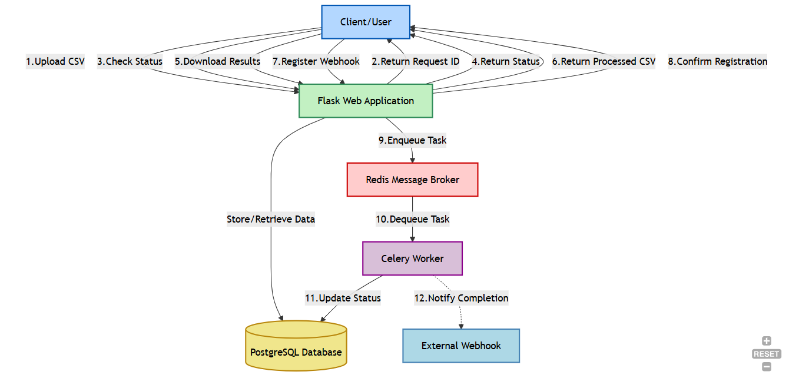

# Low-Level Design Document: Image Processing System

## 1. System Overview
The Image Processing System processes image data from CSV files with these components:
- **Web Service (Flask)**
- **Database (PostgreSQL)**
- **Message Queue (Redis)**
- **Worker Service (Celery)**
- **Image Processor**

## System Architecture



## 3. Component Specifications

### 3.1 Web Service
- Validates CSV file structure and content
- Creates and manages processing requests
- Exposes REST API endpoints for client interaction
- Enqueues processing tasks to Redis

### 3.2 Database
- Stores request metadata and processing status
- Tracks product information and image URLs

### 3.3 Message Queue
- Distributes processing tasks to workers
- Tracks task status and completion
- Handles retry logic for failed tasks

### 3.4 Worker Service
- Processes tasks from the queue
- Executes image compression operations
- Updates processing status in database
- Triggers completion notifications

### 3.5 Image Processor
- Downloads source images from URLs
- Compresses images to target quality
- Uploads processed images to storage

## 4. Database Schema (Note that i have defined the database using SQLAlchemy ORM in the code but the following SQL code is the equivalent of what we have)

### 4.1 Requests Table
```sql
CREATE TABLE requests (
    id SERIAL PRIMARY KEY,
    request_id VARCHAR(36) UNIQUE NOT NULL,
    status VARCHAR(20) NOT NULL DEFAULT 'PENDING',
    created_at TIMESTAMP NOT NULL DEFAULT CURRENT_TIMESTAMP,
    updated_at TIMESTAMP NOT NULL DEFAULT CURRENT_TIMESTAMP,
    webhook_url VARCHAR(255)
);

CREATE INDEX idx_requests_request_id ON requests(request_id);
```

### 4.2 Products Table
```sql
CREATE TABLE products (
    id SERIAL PRIMARY KEY,
    request_id VARCHAR(36) NOT NULL,
    serial_number INTEGER NOT NULL,
    product_name VARCHAR(255) NOT NULL,
    input_image_urls TEXT NOT NULL,
    output_image_urls TEXT,
    status VARCHAR(20) NOT NULL DEFAULT 'PENDING',
    created_at TIMESTAMP NOT NULL DEFAULT CURRENT_TIMESTAMP,
    updated_at TIMESTAMP NOT NULL DEFAULT CURRENT_TIMESTAMP,
    FOREIGN KEY (request_id) REFERENCES requests(request_id)
);

CREATE INDEX idx_products_request_id ON products(request_id);
```

## 5. API Endpoints

| Endpoint | Method | Description |
|----------|--------|-------------|
| `/api/upload` | POST | Accepts CSV file, validates format, returns request ID |
| `/api/status/{request_id}` | GET | Checks processing status using request ID |
| `/api/download/{request_id}` | GET | Downloads processed results as CSV |
| `/api/webhook` | POST | Registers webhook URL for completion notification |

## 6. Data Flow

### 6.1 Processing Pipeline
1. Client uploads CSV file to `/api/v1/upload`
2. System validates CSV format and creates request record
3. System enqueues processing task and returns request ID
4. Worker downloads, processes, and uploads images
5. Worker updates product status upon completion
6. System triggers webhook if configured

### 6.2 Status Retrieval
1. Client requests status with request ID
2. System calculates completion percentage
3. System returns status and product-level details

### 6.3 Results Retrieval
1. Client requests results with request ID
2. System generates CSV with processed image URLs
3. System returns CSV file with processing results